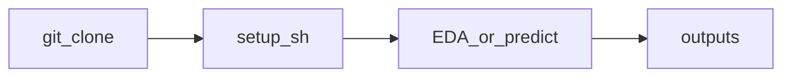

# Documentation

Quick links for this repository. Install and day-to-day commands stay in the root [README.md](../README.md).

| Document | Audience | Contents |
| --- | --- | --- |
| [devDoc.md](devDoc.md) | Developers, reviewers | Analytical goals, architecture, pipeline order, CLI, outputs, roadmap |
| [tableauDoc.md](tableauDoc.md) | Tableau authors | Seven-page workbook build, data sources, filters, validation checklist |
| [testing.md](testing.md) | Contributors | pytest strategy, fixtures, output isolation, commands |
| [configuration.md](configuration.md) | Everyone | `config.yaml` / `logging.yaml` keys and what code actually reads |

Contributors: [CONTRIBUTING.md](../CONTRIBUTING.md).

---

## Flow (high level)

After clone, run `./setup.sh` from the repo root (venv, dependencies, tests, optional prediction smoke). Then use `python cli.py --stage …` or `python cli.py --predict …` as in the main README.

---

## Flow (high level)

After clone, run `./setup.sh` from the repo root (venv, dependencies, tests, optional prediction smoke). Then use `python cli.py --stage …` or `python cli.py --predict …` as in the main README.
